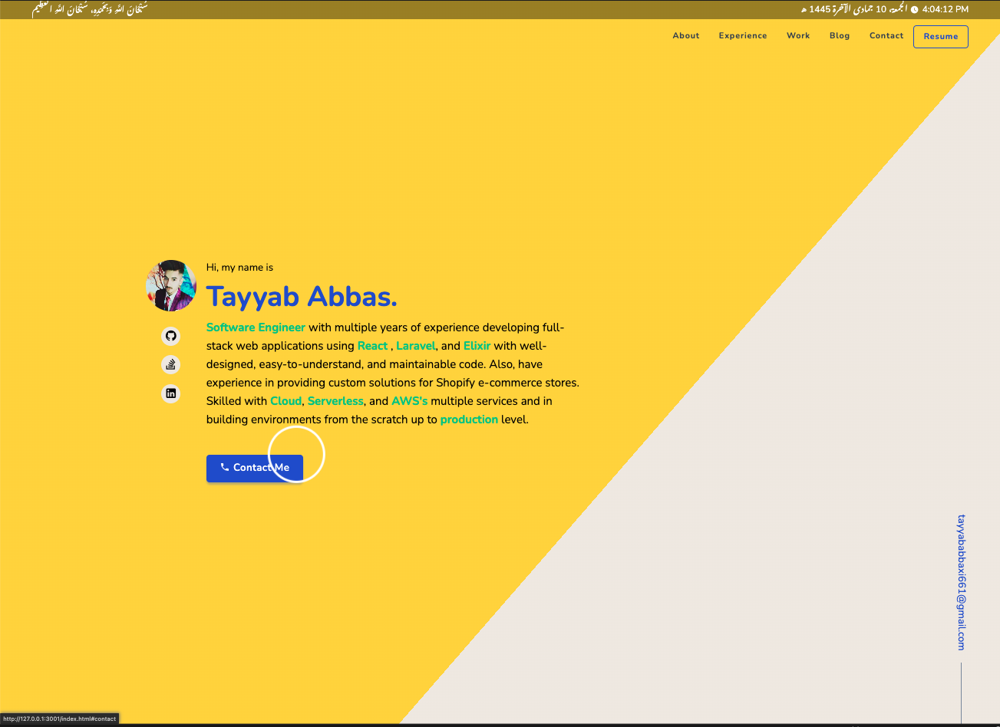

  

<h1 align="center">
  LogiCoder ;)
</h1>
<!-- 

  

 -->

## About
LogiCoder with multiple years of experience, a passionate software engineer, and an agile practitioner.

Likes to solve problems & develop high-quality software, and full-stack web applications using advanced technology & tools with well-designed, easy-to-understand, and maintainable code.

Experienced in providing custom solutions for CMS, CRM, LMS, E-commerce, etc.

Skilled with Cloud, Serverless, and AWS's multiple services and in building environments from scratch up to production level.

## 🚨  TL;DR

Many people have contacted me asking me if they can use this code for their own website, and the answer to that question is usually **yes, with attribution**.

Yes, you can fork this repo. Please give me proper credit :) by linking back to [tayyababbas](https://tayyab-abbas.github.io/tayyababbas.github.io/). Thanks!
